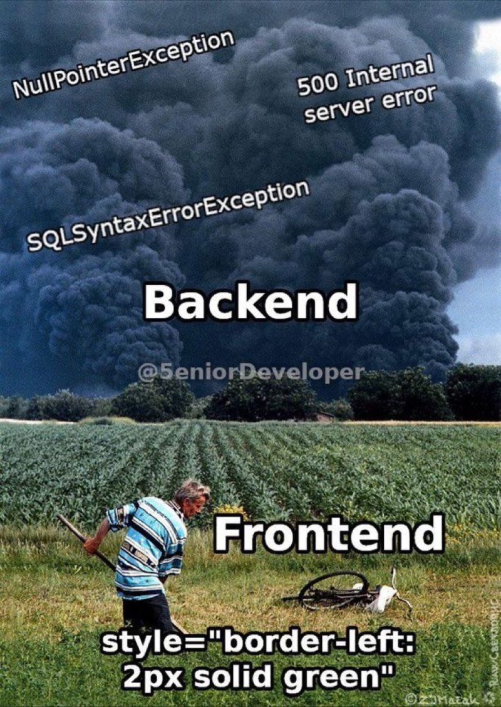

# FLUSSO DI COSCENZA DI IDEE, RIFERIMENTI E SCHIFO VARIO

*si prega la gentile utenza ad apportare il proprio contributo tramite l'aggiunta selvaggia e incontrollata si cose*

---

## intanto definiamo un attimo i requisiti

1. sta roba sta sul web
1. riconosce una pianta tramite il submit di una foto (form html)
1. geolocalizzazione dell'osservazione tramite tag gps
2. analizzare la distribuzione geografica delle osservazioni

---

 

## 1 - STA ROBBA STA SUL WEBBE

- va hostata da qualche parte, intanto abbiamo visto ste 2 opzioni
  1. [firebase](https://firebase.google.com)  possiamo collegare db direttamente, ma è in **nosql**
  2. [netifly](https://www.netlify.com)

- sviluppare un frontend che abbia un minimo di senso

 

## 2 - RICONOSCERE UNA PIANTA TRAMITE UNA FOTO

- qua no xe cazzi, usiamo la api di [plant.net](https://my.plantnet.org/doc) che da anche l'esempio di [script in python](https://github.com/plantnet/my.plantnet/blob/master/examples/post/run.py)
- le immagini restano sul guest (più facile, basta fare la richiesta POST) o le salviamo da qualche parte per riproporle poi?  poi tocca gestire un db con i path delle risorse salvate da qualche parte in un altro server
- **NB dal barbuto**: Firebase ha un limite di tipo un giga come hosting di file, quindi siamo obbligati a tenere le immagini in locale

 

## 3 - GEOLOCALIZZAZIONE

- tocca buttare su un db alemeno con:
    - uid osservazione
    - coordinate gps (dai metadati delle foto)
    - risultato identificazione (specie, famiglia, taxon ecc) 

 

## 4 - ANALISI DATI
 

- un po di python a fantasia
  - come integriamo i grafici nella pagina html?
  - grafici statici o dinamici? che libreira usiamo? 
  - se dinamici li buttiamo fuori in js (tramite altair o in altro modo?) 

- posizionamento dei tag con osservazione sulla mappa   
  
  - [folium](https://python-visualization.github.io/folium/quickstart.html) per creare una mappa interattiva con possibilità di distribuire tag ecc 
  - overlay su google maps con la sua api ([vedi tutorial](https://thedatafrog.com/en/articles/show-data-google-map-python/))
  - possibilià di filtraggio per specie, famiglia ecc. comporta la srutturazione di una nuova query al db con i dati filtrati e un nuovo csv da analizzare ogni volta?
